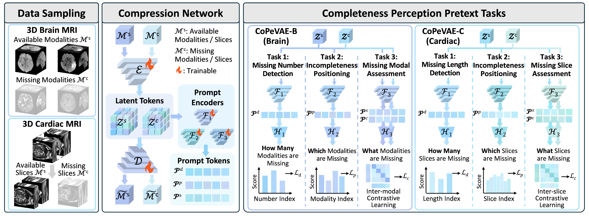
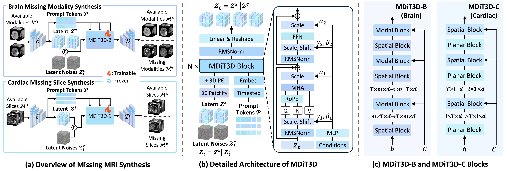
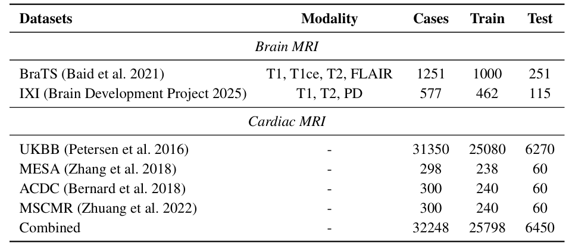

# CoPeDiT
<a href="https://arxiv.org/abs/2602.18400"></a>

Code for the paper **"Exploiting Completeness Perception with Diffusion Transformer for Unified 3D MRI Synthesis"**

## 📝 TODO
- ⏳ CoPeVAE training code
- ⏳ CoPeVAE weights
- ⏳ MDiT3D training code
- ⏳ MDiT3D inference code

## 📖 Abstract
Missing data problems, such as missing modalities in multi-modal brain MRI and missing slices in cardiac MRI, pose significant challenges in clinical practice. Existing methods rely on external guidance to supply detailed missing state for instructing generative models to synthesize missing MRIs. However, manual indicators are not always available or reliable in real-world scenarios due to the unpredictable nature of clinical environments. Moreover, these explicit masks are not informative enough to provide guidance for improving semantic consistency. In this work, we argue that generative models should infer and recognize missing states in a self-perceptive manner, enabling them to better capture subtle anatomical and pathological variations. Towards this goal, we propose CoPeDiT, a general-purpose latent diffusion model equipped with **completeness perception** for unified synthesis of 3D MRIs. Specifically, we incorporate dedicated pretext tasks into our tokenizer, CoPeVAE, empowering it to learn completeness-aware discriminative prompts, and design MDiT3D, a specialized diffusion transformer architecture for 3D MRI synthesis that effectively uses the learned prompts as guidance to enhance semantic consistency in 3D space. Comprehensive evaluations on three large-scale MRI datasets demonstrate that CoPeDiT significantly outperforms state-of-the-art methods, achieving superior robustness and yielding high-fidelity, structurally consistent synthesis across diverse missing patterns.





## 🔍 Overview
CoPeDiT is a unified framework for 3D MRI synthesis under incomplete input settings. It is designed to handle both

- **Missing modality synthesis** in multi-modal brain MRI 🧠
- **Missing slice synthesis** in cardiac MRI ❤️

The framework consists of two main components

- **CoPeVAE**  
  A completeness-aware tokenizer that learns discriminative prompts through dedicated pretext tasks 🔍

- **MDiT3D**  
  A diffusion transformer tailored for 3D MRI synthesis that leverages learned completeness prompts to improve semantic consistency in 3D space 🧩

Together, these modules enable CoPeDiT to perceive incomplete observations in a self-guided manner and perform robust unified synthesis across diverse MRI scenarios 🏆

## ✨ Features

<table>
  <tr>
    <th align="left">Feature</th>
    <th align="left">Description</th>
  </tr>
  <tr>
    <td nowrap>🧠 <strong>Unified Framework</strong></td>
    <td>A unified framework for both brain MRI missing modality synthesis and cardiac MRI missing slice synthesis.</td>
  </tr>
  <tr>
    <td nowrap>🔍 <strong>Completeness-awareness</strong></td>
    <td>CoPeVAE learns completeness-aware latent representations with dedicated pretext tasks.</td>
  </tr>
  <tr>
    <td nowrap>🧩 <strong>Specialized 3D DiT</strong></td>
    <td>MDiT3D is tailored for semantically consistent 3D MRI synthesis.</td>
  </tr>
  <tr>
    <td nowrap>🚀 <strong>Robust &amp; Generalizable</strong></td>
    <td>Delivers strong robustness and generalizability across multiple large-scale datasets.</td>
  </tr>
  <tr>
    <td nowrap>⚙️ <strong>Flexible Design</strong></td>
    <td>Supports diverse incomplete MRI settings with a flexible and unified design.</td>
  </tr>
</table>


## 🗂️ Datasets
First, you need to download the brain and cardiac MRI datasets. All datasets used in our experiments are open-source except **UKBB** and **MESA**, and can be downloaded individually from their official sources.



The structure of our dataset folder is

```text
├── dataset
    ├── BrainMRI
        ├── BraTS2021
            ├── BraTS2021_00000
                ├── BraTS2021_00000_t1.nii.gz
                ├── BraTS2021_00000_t1ce.nii.gz
                ├── BraTS2021_00000_t2.nii.gz
                └── BraTS2021_00000_flair.nii.gz
            └── BraTS2021_00002
        └── IXI
            ├── IXI-T1
                └── IXI012-HH-1211-T1.nii.gz
            ├── IXI-T2
            └── IXI-PD
    ├── CardiacMRI
        ├── UKBB
        ├── MESA
        ├── ACDC
            ├── database
                ├── training
                    ├── patient001
                        ├── patient001_frame01.nii.gz
                        └── patient001_frame12.nii.gz
                    └── patient002
                └── testing
                    ├── patient001
                        ├── patient101_frame01.nii.gz
                        └── patient101_frame14.nii.gz
                    └── patient102
        └── MSCMR
            ├── image
                ├── patient001_frame01.nii.gz
                ├── patient001_frame12.nii.gz
                └── patient002_frame01.nii.gz
```

## 🌟 Why CoPeDiT
CoPeDiT is a unified framework for 3D MRI synthesis that handles both missing modality and missing slice settings. With **completeness perception**, it enables the model to recognize incomplete observations in a self-guided manner and improve 3D semantic consistency. 

If you find this work useful, consider starring ⭐ the repository and citing our paper!

## 🙏 Acknowledgement
Our code is built upon [MONAI](https://github.com/Project-MONAI/MONAI). We sincerely thank the MONAI team and community for their open-source contributions to medical image analysis research.

## 📝 Citation

If you find this project useful, please consider citing our paper.

```bibtex
@article{liu2026exploiting,
  title={Exploiting Completeness Perception with Diffusion Transformer for Unified 3D MRI Synthesis},
  author={Liu, Junkai and Aung, Nay and Arvanitis, Theodoros N and Lima, Joao AC and Petersen, Steffen E and Alexander, Daniel C and Zhang, Le},
  journal={arXiv preprint arXiv:2602.18400},
  year={2026}
}
