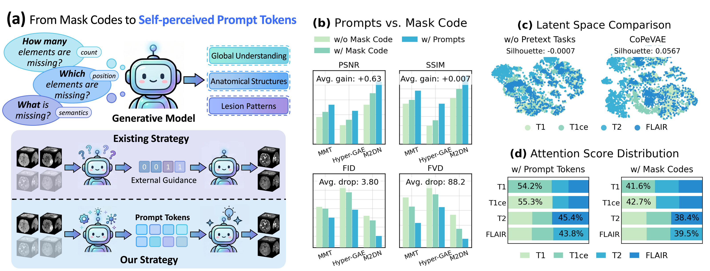
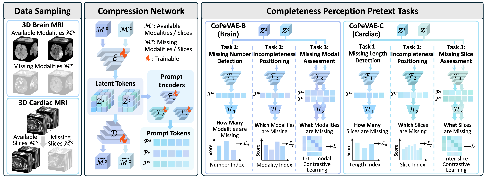
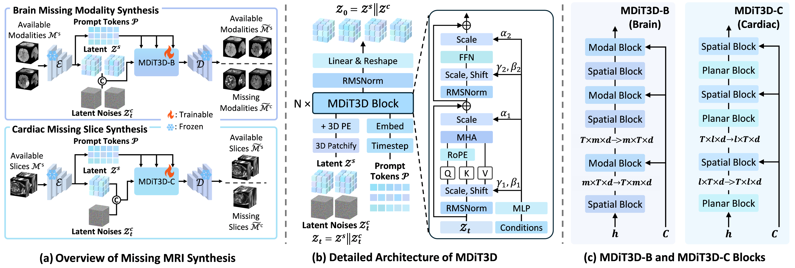
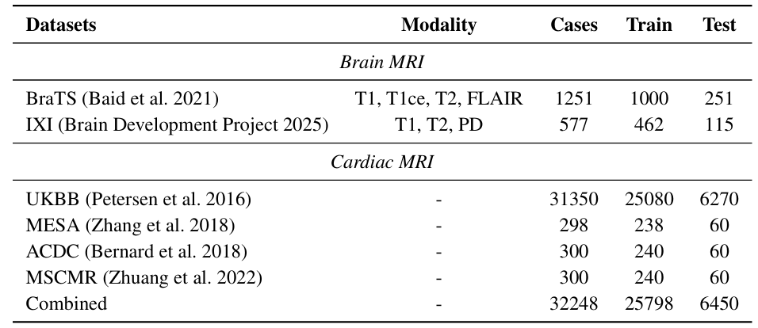

# CoPeDiT
<a href="https://openreview.net/forum?id=DCaolE9oBN"></a>
<a href="https://arxiv.org/abs/2602.18400"></a>
<a href="https://github.com/JK-Liu7/CoPeDiT"></a>

Code for the paper **"Exploiting Completeness Perception with Diffusion Transformer for Unified 3D MRI Synthesis"**

## 🔥 News

* 🎉 **Paper published:** CoPeDiT is now published in **Transactions on Machine Learning Research (TMLR)**!
* 💻 **Code released:** Training and inference code for **CoPeVAE** and **MDiT3D** is now available.

## 📌 TL;DR

**CoPeDiT** is a shared completeness-perception framework for 3D MRI synthesis under missing-modality and missing-slice settings. Instead of relying on externally supplied mask codes during generation, it learns **completeness-aware prompt tokens** that capture **how many, which/where, and what** elements are missing, and uses them to guide structurally consistent 3D MRI synthesis.



## 🔍 Overview
CoPeDiT is a shared completeness-perception framework for 3D MRI synthesis, with task-specific instantiations for different incomplete-input settings. It is designed to handle both

- **Missing modality synthesis** in multi-modal brain MRI 🧠
- **Missing slice synthesis** in cardiac MRI ❤️

The framework consists of two main components

- **CoPeVAE**  
  A completeness-aware tokenizer that learns discriminative prompts through dedicated pretext tasks 🔍

- **MDiT3D**  
  A diffusion transformer tailored for 3D MRI synthesis that leverages learned completeness prompts to improve semantic consistency in 3D space 🧩

Together, these modules enable CoPeDiT to perceive incomplete observations in a self-guided manner and perform robust unified synthesis across diverse MRI scenarios 🏆





## ✨ Highlights

<table>
  <tr>
    <th align="left">Feature</th>
    <th align="left">Description</th>
  </tr>
  <tr>
    <td nowrap>🧠 <strong>Unified MRI Synthesis</strong></td>
    <td>A shared framework for both brain MRI missing modality synthesis and cardiac MRI missing slice synthesis.</td>
  </tr>
  <tr>
    <td nowrap>🔍 <strong>Self-Perceived Completeness</strong></td>
    <td>CoPeVAE learns completeness-aware latent representations with dedicated pretext tasks.</td>
  </tr>
  <tr>
    <td nowrap>🧩 <strong>Dependency-Aligned 3D DiT</strong></td>
    <td>MDiT3D is tailored for semantically consistent 3D MRI synthesis.</td>
  </tr>
  <tr>
    <td nowrap>🔌 <strong>Plug-and-Play Prompt Tokens</strong></td>
    <td>Prompt tokens improve existing mask-conditioned baselines.</td>
  </tr>
  <tr>
    <td nowrap>🚀 <strong>Robust Missing-Pattern Synthesis</strong></td>
    <td>Supports diverse and unseen missing MRI configurations.</td>
  </tr>
</table>

## 📊 Main Results

We report representative results under challenging missing settings.  
For complete comparisons across all missing configurations and baselines, please refer to our paper.

| Task | Dataset | Missing Setting | PSNR ↑ | SSIM ↑ | FID ↓ | FVD ↓ |
| --- | --- | --- | --- | --- | --- | --- |
| Brain MRI missing modality synthesis | BraTS | 3 missing modalities | **27.91** | **0.822** | **14.89** | **323.19** |
| Brain MRI missing modality synthesis | IXI | 2 missing modalities | **23.92** | **0.721** | **32.53** | **718.54** |
| Cardiac MRI missing slice synthesis | UKBB | 24 missing slices | **25.39** | **0.817** | **25.84** | **490.57** |

## 🛠️ Installation
Clone the repository and install dependencies:
```
git clone https://github.com/JK-Liu7/CoPeDiT.git
cd CoPeDiT

conda create -n copedit python=3.11
conda activate copedit
pip install -r requirements.txt
```

## 🗂️ Datasets
First, you need to download the brain and cardiac MRI datasets. All datasets used in our experiments are open-source except **UKBB** and **MESA**, and can be downloaded individually from their official sources.



The structure of our dataset folder is

```text
├── dataset
    ├── BrainMRI
        ├── BraTS2021
            ├── BraTS2021_00000
                ├── BraTS2021_00000_t1.nii.gz
                ├── BraTS2021_00000_t1ce.nii.gz
                ├── BraTS2021_00000_t2.nii.gz
                └── BraTS2021_00000_flair.nii.gz
            └── BraTS2021_00002
        └── IXI
            ├── IXI-T1
                └── IXI012-HH-1211-T1.nii.gz
            ├── IXI-T2
            └── IXI-PD
    ├── CardiacMRI
        ├── UKBB
        ├── MESA
        ├── ACDC
            ├── database
                ├── training
                    ├── patient001
                        ├── patient001_frame01.nii.gz
                        └── patient001_frame12.nii.gz
                    └── patient002
                └── testing
                    ├── patient001
                        ├── patient101_frame01.nii.gz
                        └── patient101_frame14.nii.gz
                    └── patient102
        └── MSCMR
            ├── image
                ├── patient001_frame01.nii.gz
                ├── patient001_frame12.nii.gz
                └── patient002_frame01.nii.gz
```

## 🚀 Usage

CoPeDiT follows a two-stage training pipeline:

1. **Stage I:** Train **CoPeVAE** to learn latent representations and completeness-aware prompts.
2. **Stage II:** Train **MDiT3D** for prompt-guided 3D MRI synthesis using the trained CoPeVAE tokenizer.

By default, all training scripts are configured for **distributed training with DDP on 4 GPUs**. Please modify the number of GPUs and the related distributed settings in the corresponding `.sh` files according to your hardware environment.


### 🧠 Brain MRI Synthesis

For brain MRI, CoPeDiT performs **missing modality synthesis** on multi-modal MRI datasets, including **BraTS** and **IXI**.

The target dataset and missing modality setting are specified by arguments in the corresponding scripts:

- `args.dataset`: specifies the dataset, e.g., `BraTS` or `IXI`.
- `args.missing_num`: specifies the number of missing modalities to synthesize.

For example, set `--dataset BraTS` and choose `--missing_num` from `{1, 2, 3}` for BraTS, or from `{1, 2}` for IXI.

#### Stage I: Train CoPeVAE-B

```bash
bash train_CoPeVAE_Brain.sh
```

This stage trains the brain MRI tokenizer CoPeVAE-B, which learns completeness-aware prompts for missing modality perception.

#### Stage II: Train MDiT3D-B
```bash
bash train_MDiT3D_Brain.sh
```

This stage trains MDiT3D-B for missing modality synthesis, using the latent representations and prompt tokens produced by CoPeVAE-B.

#### Inference

After training, run the inference script to synthesize missing brain MRI modalities:

```bash
bash inference_MDiT3D_Brain.sh
```

### ❤️ Cardiac MRI Synthesis

For cardiac MRI, CoPeDiT performs **missing slice synthesis** on incomplete volumetric cardiac MRI scans. The current implementation supports the **UKBB** dataset.

The missing slice setting is specified by arguments in the corresponding scripts:

- `args.dataset`: specifies the dataset, currently `UKBB`.
- `args.missing_num`: specifies the number of missing slices to synthesize, e.g., `8`, `16`, or `24`.

For example, set `--dataset UKBB` and choose `--missing_num` from `{8, 16, 24}`.

#### Stage I: Train CoPeVAE-C

```bash
bash train_CoPeVAE_Cardiac.sh
```

This stage trains the cardiac MRI tokenizer CoPeVAE-C, which learns completeness-aware prompts for missing slice perception.

#### Stage II: Train MDiT3D-C

```bash
bash train_MDiT3D_Cardiac.sh
```

This stage trains MDiT3D-C for missing slice synthesis, guided by the learned completeness-aware prompts.

#### Inference

After training, run the inference script to synthesize missing cardiac MRI slices:

```bash
bash inference_MDiT3D_Cardiac.sh
```

### 📌 Notes

- Please update `--dataset`, `--missing_num`, dataset paths, output directories, and checkpoint paths in the corresponding scripts before running.
- Stage II training requires the trained CoPeVAE checkpoint from Stage I.

## 🌟 Why CoPeDiT
CoPeDiT is a unified framework for 3D MRI synthesis that handles both missing modality and missing slice settings. With **completeness perception**, it enables the model to recognize incomplete observations in a self-guided manner and improve 3D semantic consistency. 

If you find this work useful, please consider starring ⭐ this repository.

## 🙏 Acknowledgement
Our code is built upon [MONAI](https://github.com/Project-MONAI/MONAI). We sincerely thank the MONAI team and community for their open-source contributions to medical image analysis research.

## 💬 Questions / Contact

For questions regarding CoPeDiT, please feel free to open a GitHub issue or contact us at [jxl1920@student.bham.ac.uk](mailto:jxl1920@student.bham.ac.uk) or [liujk1997@gmail.com](mailto:liujk1997@gmail.com).

## 📝 Citation

If you find this project useful, please consider citing our paper.

```bibtex
@article{
liu2026exploiting,
title={Exploiting Completeness Perception with Diffusion Transformer for Unified 3D {MRI} Synthesis},
author={Junkai Liu and Nay Aung and Theodoros N. Arvanitis and Joao A. C. Lima and Steffen E. Petersen and Le Zhang},
journal={Transactions on Machine Learning Research},
issn={2835-8856},
year={2026},
url={https://openreview.net/forum?id=DCaolE9oBN},
}
