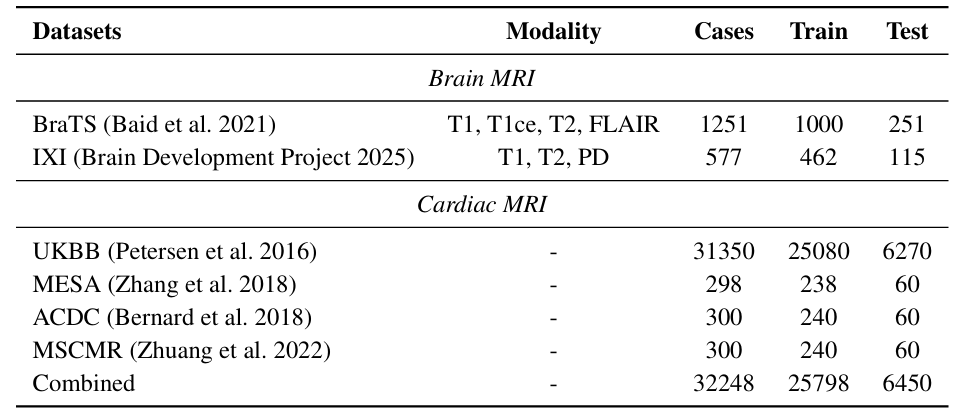

# CoPeDiT
Code for the paper "Exploiting Completeness Perception with Diffusion Transformer for Unified 3D MRI Synthesis"

## Abstract
Missing data problems, such as missing modalities in multi-modal brain MRI and missing slices in cardiac MRI, pose significant challenges in clinical practice. Existing methods rely on external guidance to supply detailed missing state for instructing generative models to synthesize missing MRIs. However, manual indicators are not always available or reliable in real-world scenarios due to the unpredictable nature of clinical environments. Moreover, these explicit masks are not informative enough to provide guidance for improving semantic consistency. In this work, we argue that generative models should infer and recognize missing states in a self-perceptive manner, enabling them to better capture subtle anatomical and pathological variations. Towards this goal, we propose CoPeDiT, a general-purpose latent diffusion model equipped with ***completeness perception*** for unified synthesis of 3D MRIs. Specifically, we incorporate dedicated pretext tasks into our tokenizer, CoPeVAE, empowering it to learn completeness-aware discriminative prompts, and design MDiT3D, a specialized diffusion transformer architecture for 3D MRI synthesis, that effectively uses the learned prompts as guidance to enhance semantic consistency in 3D space. Comprehensive evaluations on three large-scale MRI datasets demonstrate that CoPeDiT significantly outperforms state-of-the-art methods, achieving superior robustness, generalizability, and flexibility.


## Datasets
First, you need to download the brain and cardiac MRI datasets. All dataset used in our experiment are open-source except UKBB and MESA, and you can download yourself.



The structure of our dataset folder is:
```
├── dataset
    ├── BrainMRI
        ├── BraTS2021
            ├── BraTS2021_00000
                ├── BraTS2021_00000_t1.nii.gz
                ├── BraTS2021_00000_t1ce.nii.gz
                ├── BraTS2021_00000_t2.nii.gz
                └── BraTS2021_00000_flair.nii.gz
            └── BraTS2021_00002
        └── IXI
            ├── IXI-T1
                └── IXI012-HH-1211-T1.nii.gz
            ├── IXI-T2
            └── IXI-PD
    ├── CardiacMRI
        ├── UKBB
        ├── MESA
        ├── ACDC
            ├── database
                ├── training
                    ├── patient001
                        ├── patient001_frame01.nii.gz
                        └── patient001_frame12.nii.gz
                    └── patient002
                └── testing
                    ├── patient001
                        ├── patient101_frame01.nii.gz
                        └── patient101_frame14.nii.gz
                    └── patient102
        └── MSCMR
            ├── image
                ├── patient001_frame01.nii.gz
                ├── patient001_frame12.nii.gz
                └── patient002_frame01.nii.gz

